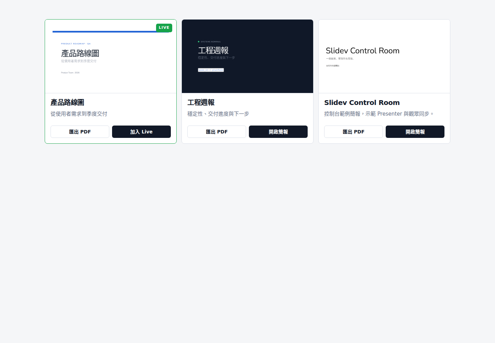
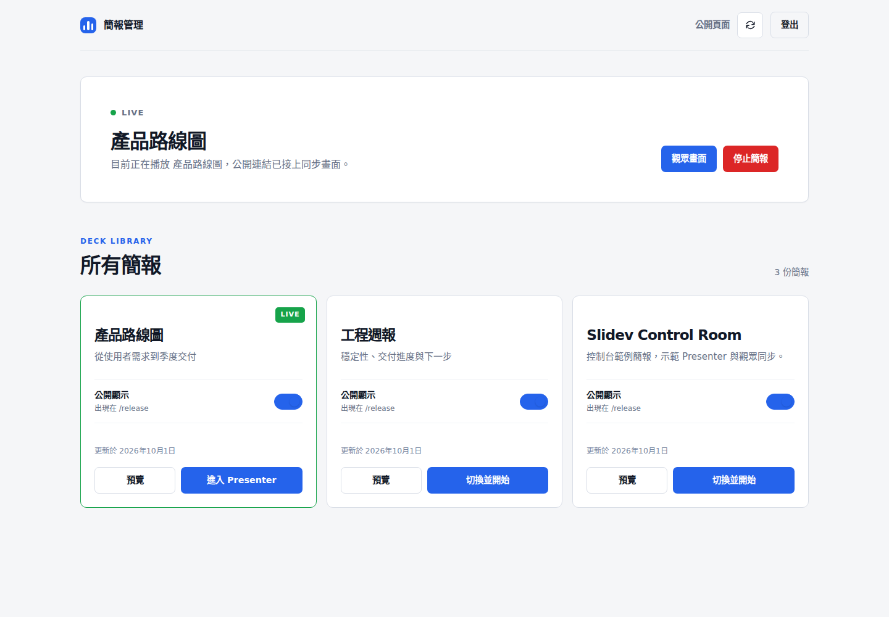

# Slidev Control Room

用一個服務公開、管理與現場播放多份 [Slidev](https://sli.dev/) 簡報。每份簡報保持標準 Slidev 專案結構，可以在任意機器編輯，再部署到同一個 Control Room。

這個專案沒有 fork 或修改 Slidev 原始碼。Slidev 負責簡報渲染、Presenter、觀眾同步與 Browser Exporter；Control Room 負責簡報清單、登入、公開狀態、路由與 Live 程序生命週期。





## 功能

- 一個 Node.js 服務管理任意數量的 Slidev deck。
- `/release` 顯示所有已公開簡報、首頁縮圖與 PDF 匯出入口。
- `/slides` 提供密碼登入、公開開關、預覽與 Live 切換。
- `/slide/<id>/` 是固定公開連結；Live 開始後自動切換為同步觀眾畫面。
- Presenter 切頁時，觀眾畫面透過 Slidev Remote 同步。
- 同一時間最多啟動一個 Slidev Live 子程序，不需要為每份簡報開一個 PM2 app。
- 公開建置會排除講者備註，Presenter View 只有管理者能開啟。
- 使用 Slidev Browser Exporter 在瀏覽器渲染並另存 PDF，不在伺服器儲存 PDF。
- 含 slug 白名單、簽署 session cookie、登入限速與同步寫入權限。
- 支援 PM2 與 Docker Compose。

## 運作方式

```mermaid
flowchart LR
  A[decks/*/slides.md] --> B[npm run build]
  B --> C[Static decks + thumbnails]
  C --> D[Express Control Room]
  D --> E[/release]
  D --> F[/slides]
  F -->|Start Live| G[One Slidev child process]
  G --> H[Presenter]
  G --> I[Synchronized audience]
```

沒有 Live 時，`/slide/<id>/` 由 Express 提供建置好的靜態簡報。開始 Live 後，同一條路徑會代理到內部 Slidev dev server，並保留 WebSocket 與 Presenter 同步。

## 需求

- Node.js `22.12` 以上，建議 Node.js 24 LTS。
- npm。
- Chromium，只在 build 產生縮圖時使用。
- PM2 為選用；只有使用 PM2 部署時才需要。

## 快速開始

```bash
npm ci
npx playwright install chromium
cp .env.example .env
npm run build
npm start
```

然後開啟：

- 公開頁：<http://localhost:3000/release>
- 管理頁：<http://localhost:3000/slides>

專案內含 `welcome`、`demo-product` 與 `demo-engineering` 三份不含外部素材的範例簡報。第一次進入 `/slides` 後，可以選擇要公開的 deck。

## 新增簡報

每份簡報放在獨立目錄：

```text
decks/
└── my-talk/
    ├── slides.md
    ├── public/
    │   └── images/
    ├── components/       # 選用
    ├── layouts/          # 選用
    └── style.css         # 選用
```

`my-talk` 會成為簡報 ID 與 URL 的一部分。ID 最長 64 字元，只能使用英文字母、數字、`-` 與 `_`；建議使用小寫。

`slides.md` 至少應包含：

```yaml
---
theme: default
title: 產品進度報告
info: 2026 年 10 月版
---
```

`title` 與 `info` 會顯示在簡報卡片。新增或修改後執行：

```bash
npm run build
```

build 會做四件事：

1. 將每份 deck 建置到 `dist/slides/<id>/`。
2. 從公開版移除講者備註。
3. 產生 `dist/thumbnails/<id>.png` 首頁縮圖。
4. 啟用 Browser Exporter，並強制關閉公開 editor 與 MCP。

建置完成後，到 `/slides` 預覽並開啟「公開顯示」。僅修改 deck 內容不需要重啟主服務。

### 從另一台機器搬入 Slidev

從原專案複製這些原始檔：

- `slides.md`
- `public/`
- `components/`
- `layouts/`
- `style.css`
- 簡報使用的其他原始檔

不要複製 `node_modules/`、`dist/`、`.git/` 或 `.env`。如果 deck 使用額外的 npm 套件或 Slidev theme，請將依賴安裝到 Control Room 根目錄。

### 靜態檔與 base path

將圖片放在 deck 自己的 `public/` 下：

```text
decks/my-talk/public/images/diagram.png
```

一般 Markdown 可以使用 ``。如果自訂 Vue layout 透過 frontmatter 接收根目錄圖片路徑，請先轉換：

```ts
const resolvedImage = computed(() =>
  props.image?.startsWith('/')
    ? `${import.meta.env.BASE_URL}${props.image.slice(1)}`
    : props.image,
)
```

請勿在 deck 內寫死網域、port 或 `/slide/<id>/`。

## 路由

| 路徑 | 用途 |
| --- | --- |
| `/release` | 公開簡報清單 |
| `/slides` | 登入後的簡報管理 |
| `/slide/<id>/` | 固定公開連結；靜態與 Live 共用 |
| `/export/<id>/#/export` | Slidev Browser Exporter |

靜態簡報的特定頁使用 `#/31`；Live 模式使用 `/31`。服務會在 Live 期間轉換舊的 hash 頁碼連結。

## PDF 匯出

`/release` 的「匯出 PDF」會開啟 Slidev Browser Exporter。在匯出頁按 `PDF`，再在瀏覽器列印視窗選擇「另存為 PDF」。頁面尺寸來自 deck 的 `canvasWidth` 與 `aspectRatio`，例如 `960 × 540` 為 16:9。

匯出器使用靜態公開 build，因此 Live 進行中也不會暴露講者備註或要求 Presenter 密碼。PDF 是由使用者瀏覽器渲染，服務器不會預先產生或儲存 PDF。

## 環境變數

| 變數 | 預設 | 用途 |
| --- | --- | --- |
| `PORT` | `3000` | Control Room HTTP port |
| `SLIDEV_PORT` | `3031` | 內部 Live Slidev port，不應直接對外開放 |
| `ADMIN_PASSWORD` | 隨機 | `/slides` 密碼；正式環境必填 |
| `SESSION_SECRET` | 隨機 | 簽署 session cookie；正式環境必填 |
| `REMOTE_PASSWORD` | 隨機 | Slidev Presenter 密碼；正式環境建議固定 |
| `COOKIE_SECURE` | production 時為 `true` | 只有直接 HTTP 測試才設為 `false` |
| `STATE_FILE` | `data/decks.json` | 公開狀態儲存位置 |

`.env` 已列入 `.gitignore`。請使用至少 32 bytes 的隨機 `SESSION_SECRET`，並且不要提交密碼、session cookie 或含 Presenter 密碼的 URL。

## PM2 部署

```bash
npm ci
npx playwright install chromium
cp .env.example .env
npm run build
npm run pm2:start
pm2 save
```

維護指令：

```bash
npm run pm2:status
npm run pm2:restart
pm2 logs slidev-control-room --lines 100
```

PM2 只需要 `slidev-control-room` 一個 app。按下「開始簡報」後，Control Room 才會建立一個 Slidev 子程序；切換 deck 會先終止前一個。

## Docker Compose

```bash
cp .env.example .env
docker compose up --build -d
```

Docker image 在 build stage 安裝 Chromium 並產生縮圖，runtime image 不包含 Chromium。`slidev-data` volume 會保留公開狀態。新增或修改 deck 後，執行 `docker compose up --build -d` 重新建置 image。

## Nginx 反向代理

Live 同步需要 WebSocket upgrade。可以使用 [docs/nginx.conf.example](docs/nginx.conf.example) 作為起點。重點是將所有路徑都轉給 Control Room，並保留 `Upgrade` 與 `Connection` headers。

正式環境應由 HTTPS 反向代理提供對外連線，`SLIDEV_PORT` 只綁定 `127.0.0.1`。

## 資料與備份

- `decks/`：簡報原始檔，必須備份。
- `data/decks.json`：公開狀態，由管理介面寫入。該檔案已忽略 Git。
- `.env`：機密設定，只放入受保護的備份。
- `dist/` 與 `node_modules/`：可重建，不需要備份或提交。

## 測試與專案截圖

```bash
npm run build
npm test
```

Smoke test 會在隨機臨時狀態檔上啟動獨立服務，驗證公開路由、登入、發布、slug injection guard、Live 切換與 WebSocket 代理。

如果服務已在 `http://localhost:3000` 執行，可重新產生 README 截圖：

```bash
npm run screenshots
```

截圖腳本使用內建 demo 資料與 API mock，不會拍到生產簡報或改動公開狀態。

## 常見問題

### 預覽按鈕被停用

Control Room 已找到 `slides.md`，但尚未找到 `dist/slides/<id>/index.html`。執行 `npm run build` 後重新整理 `/slides`。

### 簡報圖片 404

確認檔案放在該 deck 的 `public/`。如果是自訂 layout 的 frontmatter 圖片，使用上面的 `import.meta.env.BASE_URL` 轉換。

### 觀眾沒有跟著切頁

1. 從已登入的 `/slides` 按「開始簡報」進入 Presenter。
2. 確認 `/api/releases` 的 `live.state` 為 `running`。
3. 確認反向代理允許 WebSocket upgrade。
4. 查看 `pm2 logs slidev-control-room --lines 100`。

### 縮圖建置失敗

執行 `npx playwright install chromium`，再重新執行 `npm run build`。Linux 主機如果缺少 Chromium 系統依賴，使用 `npx playwright install --with-deps chromium`。

## License

[MIT](LICENSE)
